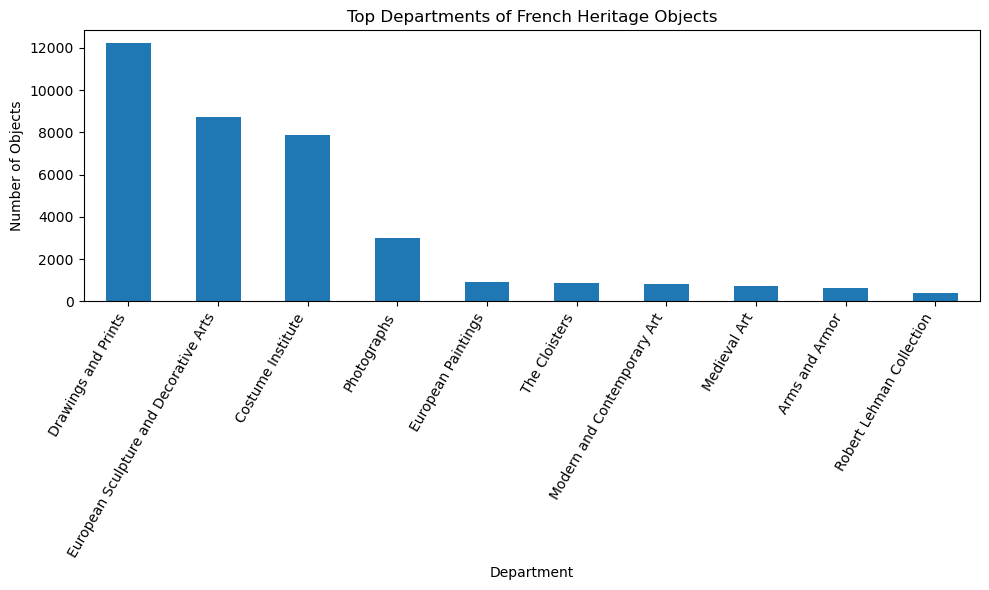
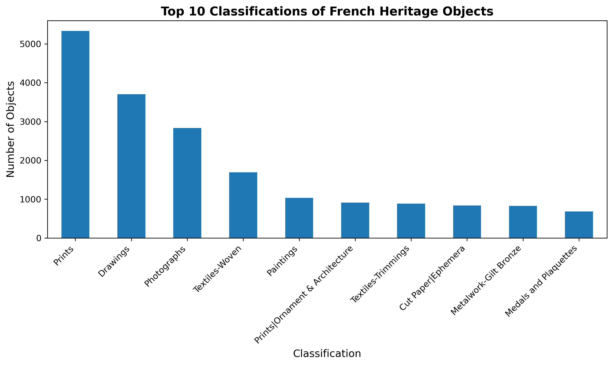
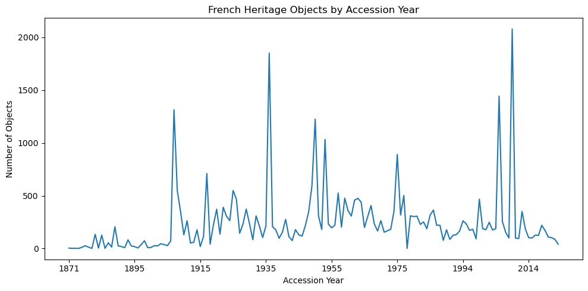

# French Artistic Heritage in the Metropolitan Museum Collection

## Project Overview

This project investigates the representation of French artistic heritage within the Metropolitan Museum of Art Open Access collection. Using museum metadata and digital humanities methods, the project explores how French artistic heritage is documented, classified, collected, and represented across museum departments, object classifications, artist nationalities, and acquisition periods.

The project was developed as part of the course *Open Scholarship in History and the Humanities: Resources, Tools, and Methods for Research Implementation*. It follows principles of open, transparent, and reproducible research using Python, Jupyter Notebook, and GitHub.

## Research Question

What aspects of French artistic heritage are most prominently represented in the Metropolitan Museum of Art collection?
## Visualizations

### Department Distribution

### Accession Year Analysis

## Open Scholarship and Licensing

This project uses the Metropolitan Museum of Art Open Access Dataset.

Dataset Repository:

https://github.com/metmuseum/openaccess

The dataset is distributed under the CC0 (Creative Commons Zero) licence, allowing unrestricted reuse of metadata.

## Dataset

### Sources

Metropolitan Museum of Art Open Access Dataset (MetObjects.csv)

- Metropolitan Museum of Art Open Access Dataset:
  https://github.com/metmuseum/openaccess

- Metropolitan Museum of Art Open Access Initiative:
  https://www.metmuseum.org/about-the-met/policies-and-documents/open-access
### Selected Metadata Variables

* Culture
* Artist Nationality
* Department
* Classification
* Object Name
* Title
* AccessionYear
* Period
* Dynasty

These variables were selected because they contribute directly to answering the research question.

## Workflow

1. Data collection from the Metropolitan Museum Open Access repository.
2. Loading the dataset into Jupyter Notebook using pandas.
3. Initial inspection of dataset structure and metadata.
4. Missing value analysis.
5. Selection of relevant metadata variables.
6. Filtering records related to French artistic heritage.
7. Exploratory data analysis.
8. Creation of visualisations.
9. Interpretation of results.
10. Documentation and publication through GitHub.

## Analytic Approach

This project follows an exploratory data analysis approach. After selecting relevant metadata variables, records associated with French artistic heritage were identified through cultural and nationality-related metadata.

Frequency distributions, comparisons, and visualisations were used to investigate patterns of representation across museum departments, object classifications, artist nationalities, and acquisition history.

## Tools and Libraries

| Tool / Library   | Purpose                                         |
| ---------------- | ----------------------------------------------- |
| Python           | Data analysis and processing                    |
| pandas           | Data loading, filtering, cleaning, and analysis |
| matplotlib       | Data visualisation                              |
| Jupyter Notebook | Documentation and reproducible workflow         |
| GitHub           | Version control and project publication         |
| GitHub Desktop   | Repository management                           |
| Microsoft Excel  | Initial data inspection                         |

## Visualisations

The project includes four main visualisations:

* Department Distribution of French Heritage Objects
* Classification Distribution of French Heritage Objects
* French Heritage Identification (Culture vs Artist Nationality)
* Accession Year Analysis

All visualisations are documented within the Jupyter Notebook.

## Key Findings

### Department Analysis

French heritage objects are strongly concentrated in the following departments:

* Drawings and Prints
* European Sculpture and Decorative Arts
* Costume Institute
* Photographs

This suggests that French artistic heritage is particularly represented through graphic arts, decorative arts, fashion, and photography.

### Classification Analysis

The most common object classifications include:

* Prints
* Drawings
* Photographs
* Textiles
* Paintings

These classifications dominate the museum's representation of French artistic heritage.

### Culture and Artist Nationality Comparison

French heritage is represented through both cultural classification and artist nationality. Artist nationality appears more frequently than cultural classification, indicating that French artists play an important role in the museum's documentation of French heritage.

### Accession Year Analysis

The accession year analysis reveals several acquisition peaks rather than a continuous collecting pattern. This indicates periods during which French heritage objects entered the collection at particularly high rates.

## FAIR Principles

This project follows the FAIR principles for research data:

**Findable** – The dataset is publicly available through the Metropolitan Museum Open Access repository.

**Accessible** – The dataset can be freely downloaded and accessed by researchers.

**Interoperable** – Metadata is provided in a structured CSV format that can be used across different software environments.

**Reusable** – Open licensing and detailed workflow documentation support future reuse.

## Reproducibility

All stages of the research process are documented within the Jupyter Notebook. The notebook contains the complete workflow, code, visualisations, interpretations, and conclusions necessary to reproduce the analysis.

Version control was maintained through GitHub and GitHub Desktop to ensure transparency and traceability of project development.

## Repository Structure

open-scholarship-project/
│
├── Data/
│
├── notebooks/
│   └── heritage_data_analysis.ipynb
│
├── figures/
│
└── README.md

## AI-Assisted Development

ChatGPT was used as a supplementary learning and troubleshooting tool during the development of this project, particularly for Python programming, GitHub workflow, and documentation support.
## Limitations

Several limitations should be considered when interpreting the results:

* Missing values exist in Culture and Artist Nationality.
* Metadata cannot fully represent the complexity of cultural identity.
* Cultural classifications depend on institutional cataloguing practices.
* The analysis is limited to objects contained within the Metropolitan Museum collection.
* Results rely on metadata rather than direct examination of museum objects.

## Future Work

Potential extensions of this project include:

* Metadata enrichment through Wikidata.
* Geographic visualisations of object origins.
* Analysis of artistic movements and historical periods.
* Comparative studies of multiple cultural groups.
* Interactive visualisations for public exploration.

## Conclusion

This project demonstrates how museum metadata can be used to investigate cultural heritage through computational and digital humanities methods.

By focusing on French artistic heritage within the Metropolitan Museum of Art collection, the analysis identifies patterns of representation across cultural classifications, artist nationalities, museum departments, object classifications, and acquisition history.

The results show that French heritage occupies a significant position within the collection and that open data enables transparent, reproducible, and accessible cultural heritage research.
